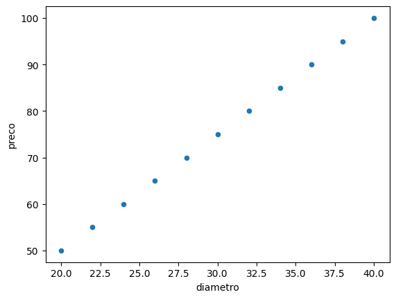
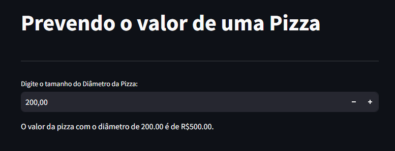

# 📌 Prevendo o Valor de uma Pizza 🍕

Este é um aplicativo simples desenvolvido com **Streamlit** e **Machine Learning** para prever o preço de uma pizza com base no seu diâmetro. O modelo utiliza **Regressão Linear** para estimar o preço com base nos dados fornecidos.

---

---

## 🛠 Requisitos

Certifique-se de ter o Python instalado em sua máquina. O projeto utiliza as seguintes bibliotecas:

- `streamlit`
- `pandas`
- `scikit-learn`

Para instalá-las, utilize o seguinte comando:

```bash
pip install streamlit pandas scikit-learn
```

---

## 🚀 Como Executar

1. Clone o repositório ou copie o código para sua máquina.
2. Certifique-se de que o arquivo `pizzas.csv` está no mesmo diretório do código.
3. Execute o seguinte comando no terminal:
   ```bash
   streamlit run app.py
   ```
4. O aplicativo abrirá no navegador e você poderá inserir o diâmetro da pizza para prever o preço.

---

## 📊 Funcionamento

- O modelo lê os dados do arquivo **pizzas.csv**.
- Utiliza **Regressão Linear** para treinar o modelo com os dados históricos.
- O usuário insere o diâmetro da pizza, e o modelo retorna o preço previsto.
- Animação com balões é exibida ao final da previsão. 🎈

---

## 📌 Exemplo de Uso

1. Digite um valor para o diâmetro da pizza.
2. O modelo calcula e exibe o preço estimado.
3. O resultado é apresentado na interface do Streamlit.

---

## Correlação Entre os dados:


---

## 📌 Interface web via Streamlit


---

## 📜 Licença

Este projeto é de uso livre. Sinta-se à vontade para modificá-lo e aprimorá-lo! 😊

